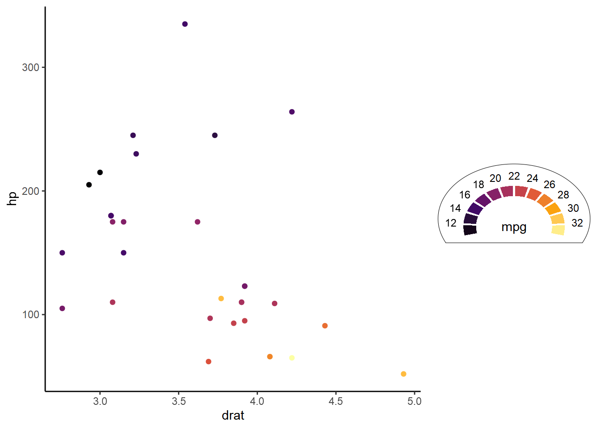
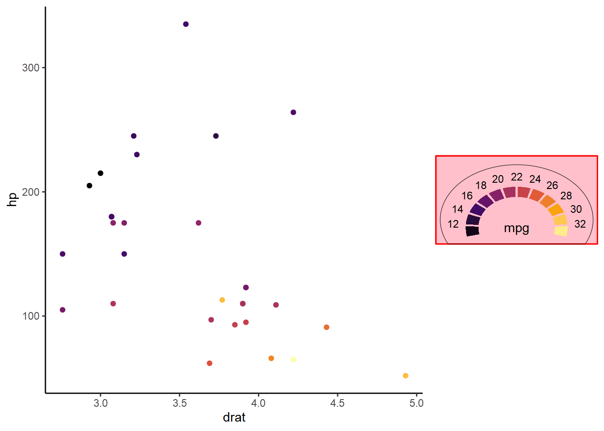
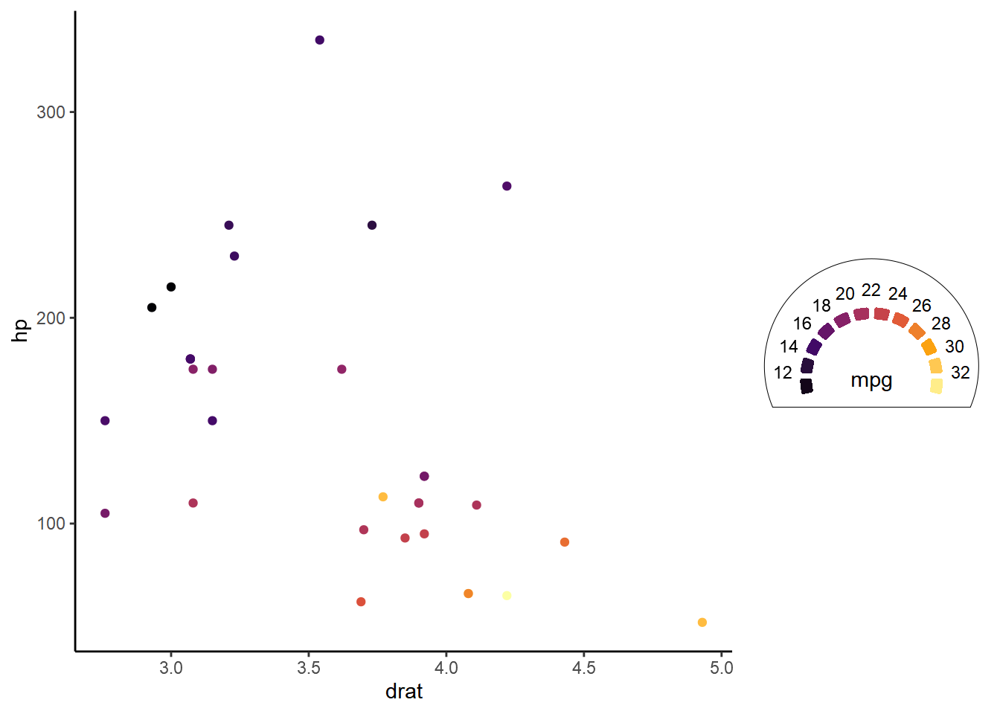
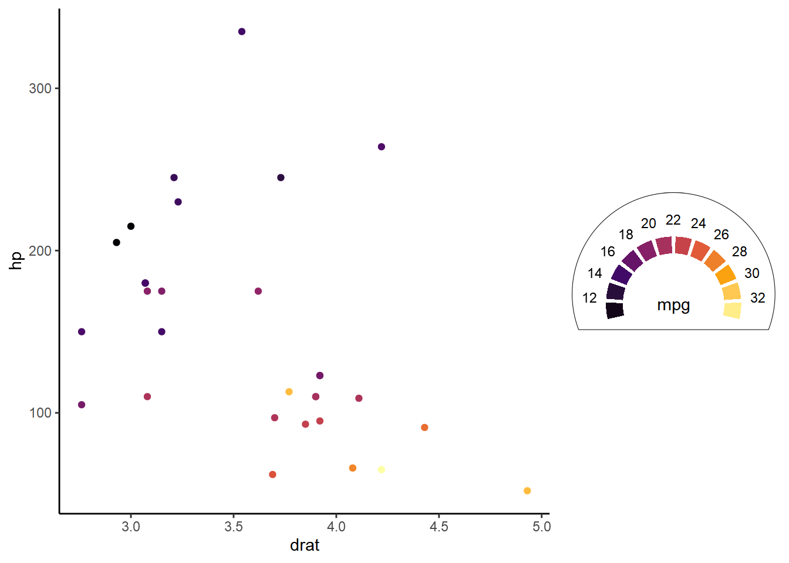
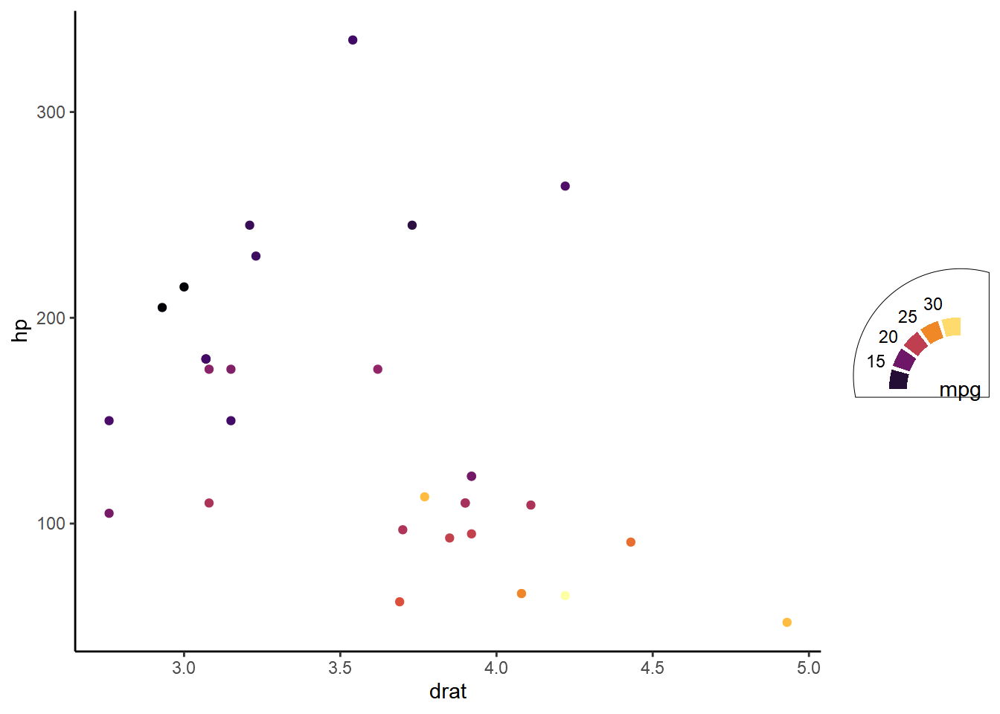
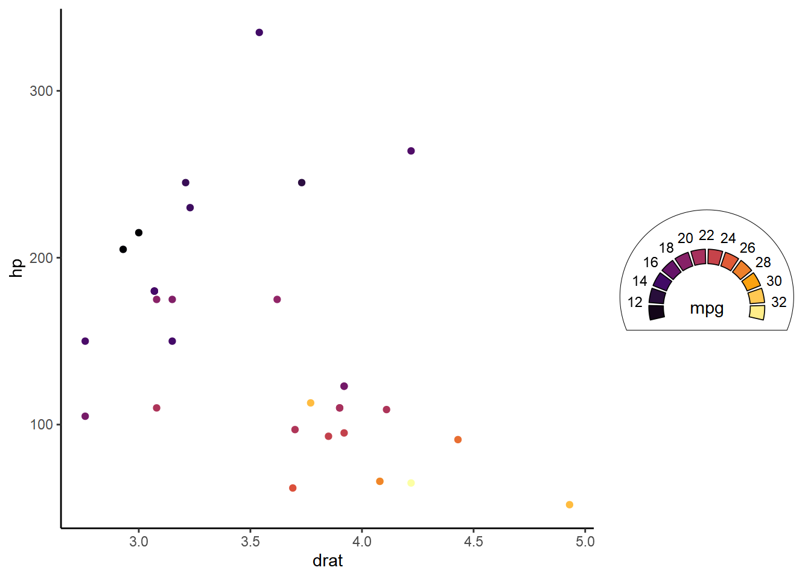

<!-- README.md is generated from README.Rmd. Please edit that file -->

# ggcolormeter

<!-- badges: start -->

[](https://lifecycle.r-lib.org/articles/stages.html#experimental)

<!-- badges: end -->

*ggcolormeter* adds `guide_colormeter()`, a {ggplot2} color/fill legend
guide extension in the style of a dashboard meter.

## Simple usage

``` r
library(ggplot2)
library(ggcolormeter)

theme_set(theme_classic())

p <- ggplot(mtcars, aes(drat, hp)) +
  geom_point(aes(color = mpg))

p +
  scale_color_viridis_c(
    option = "inferno",
    breaks = scales::breaks_pretty(10),
    guide = guide_colormeter()
  )
```


# Legend boundary

The colormeter legend is a bit pecular in that its size doesn’t expand
with more keys: the colormeter has a fixed size and shape, and its
elements are packed inside it.

You can primarily control the size of the legend with `legend_size` and
`aspect.ratio`

``` r
p +
  scale_color_viridis_c(
    option = "inferno",
    breaks = scales::breaks_pretty(10),
    guide = guide_colormeter(
      legend_size = unit(3, "cm"),
      aspect.ratio = .8
    )
  )
```


Note that the usual legend background is still present and different
from the dashboard circle:

``` r
p +
  scale_color_viridis_c(
    option = "inferno",
    breaks = scales::breaks_pretty(10),
    guide = guide_colormeter(
      legend_size = unit(3, "cm"),
      aspect.ratio = .8
    )
  ) +
  theme(legend.background = element_rect(color = "red", fill = "pink"))
```



Most of the time you’d want to remove this legend background, as the
dashboard serves that purpose:

``` r
p +
  scale_color_viridis_c(
    option = "inferno",
    breaks = scales::breaks_pretty(10),
    guide = guide_colormeter(
    )
  ) +
  theme(
    legend.position = c(.85, .75),
    legend.background = element_blank()
  )
```



## Arc

``` r
formals(guide_colormeter)[grepl("arc", names(formals(guide_colormeter)))]
#> $arc_range
#> c(-4/7 * pi, 4/7 * pi)
#> 
#> $arc_radius
#> [1] 1
#> 
#> $arc_width
#> arc_radius/4
#> 
#> $arc_gap
#> arc_radius/5
#> 
#> $arc_rounding
#> [1] 0
```

Non-positional aesthetic arguments for the color arc:

``` r
p +
  scale_color_viridis_c(
    option = "inferno",
    breaks = scales::breaks_pretty(10),
    guide = guide_colormeter(
      arc_width = 1/6, # thinner arcs
      arc_gap = 1/3, # bigger gaps
      arc_rounding = 0.03 # rounded corners
    )
  )
```



By default, label and dashboard radii are derived from `arc_radius`:

``` r
p +
  scale_color_viridis_c(
    option = "inferno",
    breaks = scales::breaks_pretty(10),
    guide = guide_colormeter(
      arc_radius = 1.2
    )
  )
```



You can use `arc_range` to set the start and end angles of the color
meter, which may yield different shapes:

``` r
p +
  scale_color_viridis_c(
    option = "inferno",
    breaks = scales::breaks_pretty(5), # half the arcs
    guide = guide_colormeter(
      arc_range = c(-pi/2, 0) # quarter circle
    )
  )
```



The defaults aren’t great for when you change from the dashboard shape.
Some manual adjustments may be desirable:

``` r
p +
  scale_color_viridis_c(
    option = "inferno",
    breaks = scales::breaks_pretty(5),
    guide = guide_colormeter(
      arc_range = c(-pi/2, 0),
      title_position = c(-.2, .2), # moves title left and up from center
      legend_padding = grid::unit(.5, "lines") # pads relative to legend label
    )
  )
```


## Label

``` r
formals(guide_colormeter)[grepl("label", names(formals(guide_colormeter)))]
#> $label.theme
#> NULL
#> 
#> $label_radius
#> arc_radius * 1.25
```

By default, the dashboard radius is derived from `label_radius`:

``` r
p +
  scale_color_viridis_c(
    option = "inferno",
    breaks = scales::breaks_pretty(10),
    guide = guide_colormeter(
      label_radius = 1.5
    )
  )
```


Like `ggplot2::guide_colorsteps()`, the argument `show.limits` controls
labeling the limits of the scale:

``` r
p +
  scale_color_viridis_c(
    option = "inferno",
    breaks = scales::breaks_pretty(10),
    guide = guide_colormeter(
      label_radius = 1.3,
      show.limits = TRUE
    )
  )
```


## Dashboard

``` r
formals(guide_colormeter)[grepl("dashboard", names(formals(guide_colormeter)))]
#> $dashboard_radius
#> label_radius * 1.2
#> 
#> $dashboard_color
#> [1] "black"
#> 
#> $dashboard_fill
#> [1] NA
#> 
#> $dashboard_linewidth
#> [1] 0.5
#> 
#> $dashboard_linetype
#> [1] 1
#> 
#> $clip_dashboard
#> [1] TRUE
#> 
#> $close_dashboard
#> clip_dashboard
```

`dashboard_radius` controls the radius of just the dashboard circle

``` r
p +
  scale_color_viridis_c(
    option = "inferno",
    breaks = scales::breaks_pretty(10),
    guide = guide_colormeter(
      dashboard_radius = 1.2,
    )
  )
```


By default, the dashboard is clipped to the legend boundary, which can
be turned off:

``` r
p +
  scale_color_viridis_c(
    option = "inferno",
    breaks = scales::breaks_pretty(10),
    guide = guide_colormeter(
      title = "mpg<br><br>
        <span style='color:darkgrey;font-size:12px'>miles per gallon</span>",
      clip_dashboard = FALSE
    )
  ) +
  theme(legend.title = ggtext::element_markdown(vjust = -.6))
```


Non-positional aesthetic arguments for the dashboard:

``` r
p +
  scale_color_viridis_c(
    option = "inferno",
    breaks = scales::breaks_pretty(10),
    guide = guide_colormeter(
      dashboard_fill = "skyblue",
      dashboard_color = "steelblue",
      dashboard_linetype = 5,
      dashboard_linewidth = 4
    )
  )
```


## Frame

``` r
formals(guide_colormeter)[grepl("frame", names(formals(guide_colormeter)))]
#> $frame_color
#> [1] NA
#> 
#> $frame_linewidth
#> [1] 0.5
#> 
#> $frame_linetype
#> [1] 1
```

Frames simply decorate the color arcs/bars:

``` r
p +
  scale_color_viridis_c(
    option = "inferno",
    breaks = scales::breaks_pretty(10),
    guide = guide_colormeter(
      frame_color = "black",
      frame_linewidth = .3
    )
  )
```


## Misc

Set `debug = TRUE` to inspect the internal legend coordinate system (for
deciding on `dashboard_radius`, `arc_width`, `title_position`, etc.):

``` r
p +
  scale_color_viridis_c(
    option = "inferno",
    breaks = scales::breaks_pretty(10),
    guide = guide_colormeter(debug = TRUE)
  )
```



Puttings labels inside the arc:

``` r
p +
  scale_color_viridis_c(
    option = "inferno",
    breaks = scales::breaks_pretty(5),
    guide = guide_colormeter(
      arc_width = 0.1,
      label_radius = .7,
      aspect.ratio = 1.1,
      dashboard_color = NA
    )
  ) +
  theme(legend.position = c(.85, .75))
```


## Acknowledgments

-   Thomas Lin Pedersen for
    [`{ggtrace}`](https://github.com/thomasp85/ggforce), whose several
    unexported functions are used in this package.
